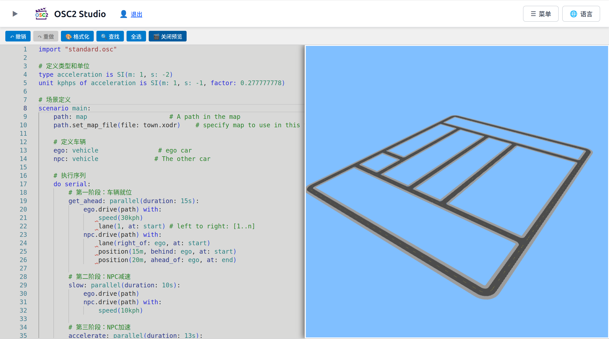

# OSC2 Studio: OpenSCENARIO 2 Online Development and Visualization Platform

---

**OSC2 Studio** is a web-based integrated development environment for OpenSCENARIO 2 (OSC2). It combines a professional editor, real-time syntax and semantic validation, intelligent code completion, 3D scene preview, and OpenDRIVE map exploration — all in your browser with zero installation.

> **Status: 🚀 Under Active Development** — latest release: [v0.0.3](https://osc2studio.online/doc/blog/release-v0.0.3)

## Core Features

### 🗺️ OpenDRIVE Map Preview
Import OpenDRIVE (.xodr) road network files and preview road layouts, intersections, and lane markings in interactive 3D. Double-click any map file to explore — no scenario required.

### 🎬 3D Scene Preview
Preview your OpenScenario2 scenarios in real-time 3D directly within the editor. Visualize vehicle movements, road layouts, and event sequences to validate your scenario logic at a glance.

### ✅ Real-time Syntax & Semantic Validation
Instant feedback on syntax and semantic errors as you type. The built-in engine performs in-depth validation of types, units, and references, following the official OpenSCENARIO 2 specification.

### ⌨️ Professional OSC2 Editor
Advanced syntax highlighting, intelligent code completion, bracket matching, and code folding — everything you need for efficient scenario authoring.

### 🌐 Zero Installation
Entirely web-based — open your browser and start creating scenarios with no downloads, installations, or configuration required.

### 🎨 Internationalization
Available in English and Chinese.

## Quick Start

1. **Open in Browser** — Visit [osc2studio.online](https://osc2studio.online), no installation needed
2. **Log In or Guest** — Log in or continue as a guest to start editing. Note: guests cannot use the scene preview feature; registered users get full access
3. **Write OSC2 Code** — Syntax highlighting, auto-completion, and real-time validation as you type
4. **Preview Scenes & Maps** — 3D scene preview and OpenDRIVE map exploration
5. **Export** — Download your completed scenarios for simulation

## What's New in v0.0.3

- **OpenDRIVE Map Preview** — import and preview .xodr road networks in 3D
- **Enhanced Road Rendering** — crosswalks, stop lines, and road markings now render correctly
- **Enhanced OpenSCENARIO 2 Support** — position modifier with richer usage: range sampling, end targets, relative positioning
- **Better UX** — double-click to open files, right-click drag to pan in previews

See the [release blog](https://docs.osc2studio.online/blog/release-v0.0.3) for full details.

## Links

- **Website**: [osc2studio.online](https://osc2studio.online)
- **Documentation**: [osc2studio.online/doc/intro](https://osc2studio.online/doc/intro)